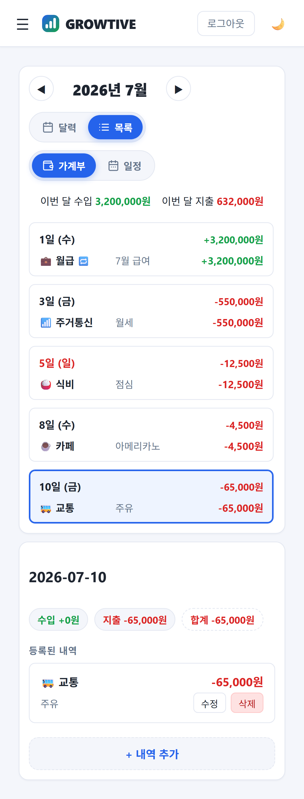
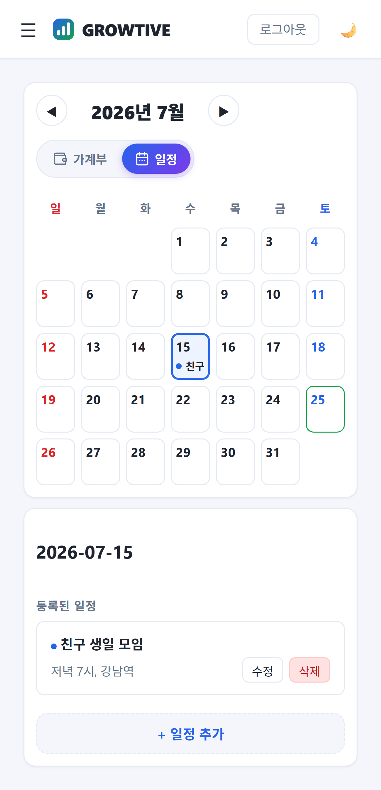
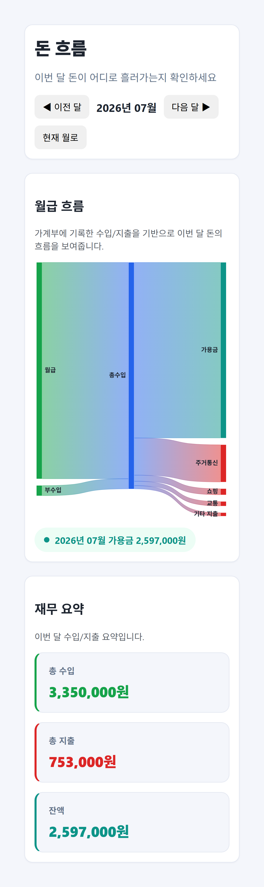
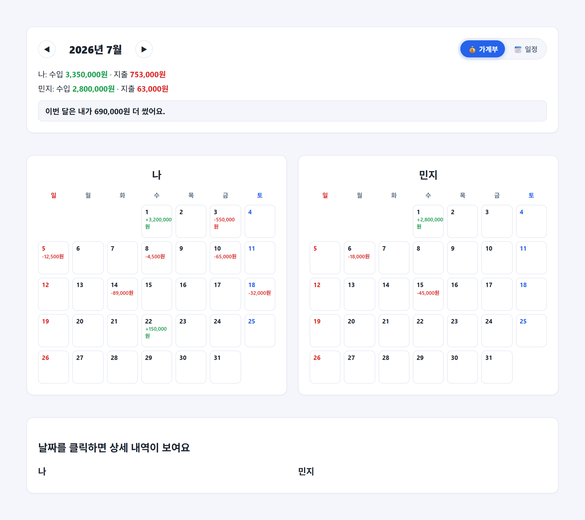

# GrowTive (그로우티브)

가계부와 일정을 한 곳에서, 가족·친구와 함께 관리하는 개인 재무·캘린더 서비스입니다.

**🔗 바로 써보기: [growtive.onrender.com](https://growtive.onrender.com)**

---

## Screenshots

| 가계부 캘린더 | 일정 캘린더 |
|---|---|
|  |  |

| 재무 대시보드 (돈 흐름) | 친구 캘린더 비교 |
|---|---|
|  |  |

---

## Features

- 📅 **가계부 캘린더** — 매일 수입/지출을 달력에 바로 기록, 매달 반복되는 월급·월세는 자동 등록
- 🗓️ **일정 캘린더** — 같은 화면에서 탭 전환, 기간/시간/색상 태그 지정, 달력·목록 두 가지 보기
- 📈 **재무 대시보드** — Sankey 차트로 이번 달 돈의 흐름(수입 → 지출)을 한눈에 시각화
- 👫 **소셜(친구 캘린더 비교)** — 아이디로 친구를 연결하고 캘린더를 비교. 단, 양쪽이 각자 공유 기간을 지정해야만 비교 가능(사생활 보호), 항목별 숨기기 지원
- 💬 **카카오 소셜 로그인** — 카카오 계정으로 바로 로그인, 기존 계정에 연결도 가능
- 📱 **모바일 최적화** — 반응형 레이아웃, 접이식 사이드바, 터치 드래그로 일정 기간 선택
- 🌙 다크 모드 지원

---

## Tech Stack

**Backend**: Spring Boot 3, Spring Security (Session + OAuth2 Client), MyBatis, MariaDB/MySQL

**Frontend**: Vanilla JS SPA (hash 라우팅, 별도 프레임워크 없음), Axios, Chart.js + chartjs-chart-sankey

**Infra**: Render(무료 티어) + Aiven MySQL(무료 티어), GitHub Actions로 콜드 슬립 방지, GitHub push 시 자동 배포

---

## Architecture

```
Page (SPA) → Axios → Spring Controller → Service → MyBatis → MariaDB
```

- 세션 기반 인증(HttpSession), 카카오 로그인은 Spring Security OAuth2 Client로 연동 후 동일한 세션 체계에 편입
- 가계부/일정은 `daily_transaction` / `schedule_event` 단일 테이블 기반, 반복 항목은 origin-occurrence 방식으로 자동 생성
- 친구 비교는 `friend_connection` 테이블의 양방향 공유 기간이 모두 채워졌을 때만 활성화

---

## Commit Convention

This project follows the Conventional Commit format.

```
feat: add login API
fix: login session bug
refactor: auth service
docs: update README
```

| Type | Description |
|-----|-------------|
| feat | 새로운 기능 |
| fix | 버그 수정 |
| refactor | 코드 구조 개선 |
| docs | 문서 수정 |
| style | 코드 스타일 변경 |
| chore | 빌드/설정 변경 |
